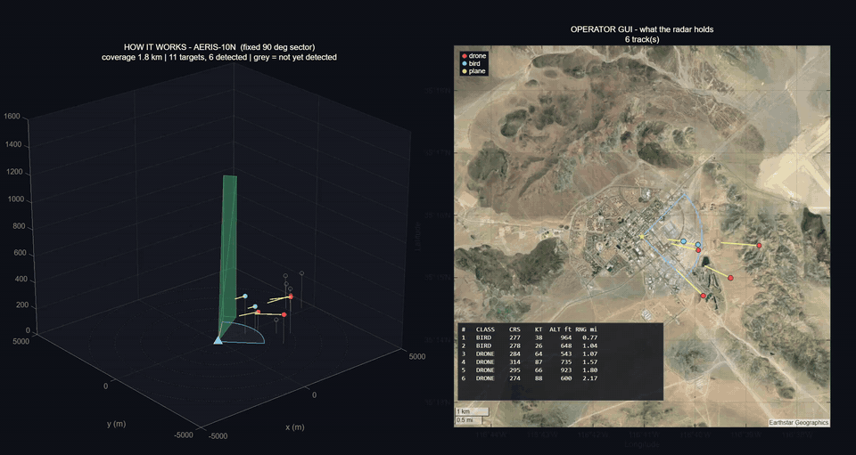
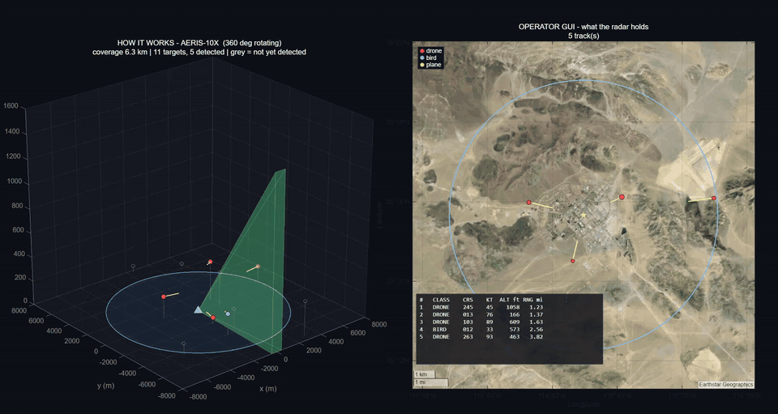

# AERIS C-UAS — a high-fidelity model of low-cost counter-drone radar

How much radar, placed where, does it take to give a unit useful warning of an
incoming small drone? This project answers that with a physics-based model of
low-cost, open-architecture X-band radar nodes — from the radar equation down
to simulated IQ samples, up through tracking, classification, networking, and
the operator's map.

A personal project by **Mark Humes**, built entirely on open-source tools and
publicly available information. The two radar architectures modelled here
are based on the open-source **[AERIS-10](https://github.com/NawfalMotii79/PLFM_RADAR)**
radar by NawfalMotii79 — full acknowledgments in
[Credits](#credits-and-acknowledgments).

> **Disclaimer.** This is an independent personal project. It is not
> affiliated with, sponsored by, or endorsed by the Department of War (DoW),
> the Department of the Navy (DON), or any academic institution, and it does
> not represent their views. It uses only open-source tools and publicly
> available information. All radar parameters are provisional placeholders
> from public datasheets and open-source designs. This is a high-fidelity
> *model*, not a validated digital twin — it has not been checked against
> physical hardware.

## Motivation

Small, cheap drones have changed the problem for small, spread-out units.
Stopping a drone is only possible if someone sees it coming in time, and the
radars that do that well are large, power-hungry, and expensive — too
expensive to put everywhere a small team needs warning.

Open-source hardware like AERIS-10 raises a different question: **could a
low-cost, attritable radar node give a unit enough warning, and if so, where
would it have to sit and what would it need to see?** I'm an electrical
engineer, and I wanted to answer that end to end — not with a single
link-budget number, but with a model that carries the physics all the way
through tracking, the network, power and cost, and the picture an operator
actually sees. A clear "no, and here is the parameter that breaks it" would
count as an answer too.

## How this was built

I built this with Claude Code (Anthropic) as an AI pair-programmer — most of
the code was written by the AI at my direction. My part was the problem and
the judgment: framing the question from military operational experience,
deciding what to model and what mattered, checking results against physics
and intuition, and catching where the model was wrong (for example, a comms
model that failed like a cliff instead of degrading gradually).

## Showcase

**AERIS-10N** — fixed 90° sector, electronically scanned, short range:



**AERIS-10X** — 360° mechanically rotating, long range:



*Left: ground truth in 3-D. Targets are grey until the beam sweeps them and
they are detected, then light up by class (drone / bird / plane) with a
course-and-speed vector and a drop-line to read altitude. Right: the operator's
view — only what the radar holds, on a satellite basemap, with a track table in
course, knots, feet, and miles.* Run it yourself: `aeris_demo3d('nexus')` or
`aeris_demo3d('extended')` in MATLAB.

### What the model covers

| layer | what is modelled |
|---|---|
| **Sensing** | Radar equation (matched-filter energy form), Swerling-1 Pd, CA-CFAR, ground clutter with MTI, rain/fog/gas attenuation (ITU-R P.676 / P.838 / P.840) and rain backscatter |
| **Signal level** | LFM chirp → pulse compression → Doppler FFT on synthetic IQ; modelled patch-array antenna; Friis RF-chain noise figure; azimuth scan loss |
| **Environment** | Terrain masking / line-of-sight on real elevation data, two-ray multipath lobing, land-cover clutter |
| **Targets** | Randomised raids (size, speed, altitude, formation, course); drone / bird / plane classes with rotor and wingbeat micro-Doppler |
| **Tracking & ID** | Constant-velocity Kalman tracker with gating and multi-node fusion; micro-Doppler classifier (~90% correct, drone↔bird is the hard case) |
| **Network** | Multi-node layouts, mesh comms link budget with graceful packet loss, WGS-84 georeferencing, Cursor-on-Target style warning output |
| **SWaP-C** | Power budget, battery endurance, bill of materials (weight and cost) per node |
| **Studies** | 15,000-raid Monte Carlo sweeps, bootstrap confidence intervals, Morris global sensitivity, layout optimisation, hardware upgrade trades |

### Headline results (modelled, provisional)

- **The advertised range is optimistic.** On a 0.03 m² small drone the 10N
  reaches a reliable **~1.8 km**, not its 3 km design figure. Adding the
  signal-level losses and the real RF chain nearly cancels out (+2.6 dB vs
  −2.5 dB), so that number holds up as fidelity increases.
- **Speed decides, not sensing.** About **63%** of randomised raids get 5
  minutes of warning over grass; the failures are fast threats, not missed
  detections. Of the weather, only rain matters at X-band; fog is
  negligible. Pushing nodes further forward stops helping at ~6 km.
- **Two architectures, one trade.** Over 15,000 raids each, the 360° 10X sees
  3.5× farther and warns more often (72% vs 54%), but costs 4× the power,
  1.7× the weight, and 3.6× the price of the 10N — a better sensor, but a
  worse attritable node. ([comparison](docs/nexus_vs_extended.md))
- **Cheap hardware closes much of the gap.** A ~$650 GaN power amplifier and
  driver adds ~65% range to a lab-grade node; with a larger array, ~$1,050
  reaches ~2.5 km. ([upgrade study](docs/nexus_upgrade_path.md))

### Running the MATLAB model

Tested in MATLAB R2026a. Needs the Phased Array System Toolbox; the Antenna,
RF, Mapping, and Parallel Computing toolboxes enable the optional
higher-fidelity and batch features. Everything is driven from one parameter
file, `matlab/aeris_params.m`; the shared physics lives in `matlab/+aeris/`.

```matlab
cd matlab
aeris_demo3d('nexus')          % 3-D + operator map, live (STOP to end)
aeris_demo3d('extended')       % same for the 360-degree 10X
aeris_scope_sim                % animated radar scope, one engagement
aeris_cop                      % operator console with warning feed
aeris_compare(4000)            % 10N vs 10X head-to-head table
aeris_upgrade_trade            % GaN PA / SDR / array upgrade trade study
```

More in [`matlab/README_matlab.md`](matlab/README_matlab.md) and
[`docs/fidelity_roadmap.md`](docs/fidelity_roadmap.md).

## What I learned

- **Advertised range is not reliable range.** A range only means something
  with a target size and a detection probability attached. Defined as 90%
  detection on a 0.03 m² drone, the 10N-class node reaches ~1.8 km, not 3 km.
- **Speed and placement matter as much as sensitivity.** Most failed
  engagements were fast threats that a better radar would not have saved;
  where the node sits and how early it looks mattered as much as how far it
  sees.
- **A cliff in the results is often a cliff in the model.** Pass/fail models
  of the comms link and the sector edge produced sharp drop-offs that looked
  like findings. Replacing them with graceful physics (packet loss that
  degrades with distance, antenna gain that rolls off at the edge) removed
  the cliffs and lowered the headline by ~3 points — the honest direction.
- **One hidden gate can zero a whole study.** A comms check made every
  network confirmation fail in a batch run, and it first looked like a
  physics problem. Sanity-checking intermediate numbers, not just the final
  statistic, found it.
- **More fidelity is not always a different answer.** Adding the real RF
  chain gained 2.6 dB; processing the signal at IQ level cost 2.5 dB. They
  nearly cancelled, so the headline range survived — which is itself
  evidence the simpler model was sound.
- **Intuition about weather was wrong.** At X-band, rain matters and fog
  essentially does not; the ITU models settled it.
- **The better sensor is not always the better system.** The 360° 10X wins
  on every sensing metric and loses on power, weight, cost, and endurance.
  Hardware details decide the budget, too: a GaN amplifier's standby current
  dominates its power draw, and the driver amplifier it needs costs more
  than the amplifier itself.
- **Watching it run is a test.** Rendering the demos exposed bugs that
  reading the code had missed — tracks that blinked between sweeps and a
  panel that showed the wrong targets.
- **Structure keeps a big model honest.** One shared physics package, one
  parameter file, SI units inside and unit conversion only at the display,
  so a dozen tools cannot drift apart.

## Next iteration

- **Validate against hardware.** Bench and field tests with corner
  reflectors of known size (a 5 cm trihedral is ~0.03 m² at 10.25 GHz) and
  GPS-logged drone flights, to confirm or calibrate each subsystem.
- **Replace placeholders with real specs.** Noise figure, losses, waveform,
  and scan timing from published or measured AERIS-10 data; in particular
  the chirp bandwidth, which sets how finely targets are separated in range.
- **Model the transmit/receive front end.** Receiver protection, and the
  blind zone while the pulse is transmitting, which the higher-power
  upgrade makes important.
- **Better clutter.** The clutter-suppression factor is the model's most
  sensitive unknown; measure it, and model the oscillator phase noise that
  limits it.
- **Harder targets and tracking.** Maneuvering targets (interacting multiple
  models), dense swarms (multi-target data association), and a classifier
  trained on measured drone and bird signatures.
- **Real terrain in the MATLAB model.** The Python stack already uses real
  elevation data; bring it into the MATLAB model end to end.
- **Pin down the requirement.** The 5-minute warning target is a working
  assumption; derive it from how a unit would actually use the warning.
- **Automated MATLAB tests** alongside the Python suite, so the two stay in
  step.

## Python simulation stack (Levels 1-4)

The analytical backbone, cross-checked against the MATLAB model: minimum
sensing and placement requirements for tactically useful counter-UAS warning.

* **Level 1** (`cuas_l1`) — deterministic mission geometry. For a given
  closure speed, how much reliable range and forward placement deliver a
  required warning time, and what does sector width do off-axis?
* **Level 2** (`cuas_l2`) — Monte Carlo over the imperfect warning chain:
  Pd(range), revisit, M-of-N track confirmation, latency, false alerts,
  node/comms availability, speed and bearing priors. Produces
  P(T_warning ≥ 300 s) rather than an average.
* **Level 4** (`cuas_l4`) — terrain and environment. Public DEM (Copernicus
  GLO-30 / USGS 3DEP) or a synthetic beach; 4/3-earth polar viewsheds for a
  mast height and a terrain-following threat altitude; land-cover shares of
  each node's visible footprint for clutter bookkeeping; placement candidates
  on real ground scored with the Level 2 Monte Carlo through the
  `visibility` hook. `scripts/run_level4.py --dem tile.tif --lon … --lat …`.
* **Level 3** (`cuas_l3`) — radar physics. Radar-equation SNR(range) for the
  8×16 X-band array, coherent integration, Swerling-1 Pd, and a land-cover
  clutter/MTI term. `PhysicsDetectionModel` implements the Level 2
  `DetectionModel` interface, so it drops into `Level2Config.detection` and
  *derives* the reliable range Levels 1-2 assumed. MATLAB Phased Array
  Toolbox cross-check scripts in `matlab/`. All AERIS-Nexus numbers are
  documented placeholders in `RadarParams` — freeze from the repo before
  citing.

## Quick start

```bash
# Windows PowerShell, WSL2, or any shell with Python 3.10+
python -m venv .venv
.venv\Scripts\activate          # Windows
# source .venv/bin/activate     # WSL2 / Linux
pip install -r requirements.txt

python scripts/run_level1.py            # figures/ and docs/level1_results.md, <5 s
python scripts/run_level2.py --quick    # ~20 s coarse run
python scripts/run_level2.py            # ~1 min full run, docs/level2_results.md
python scripts/run_level4.py --quick    # synthetic beach, ~15 s; full ~30 s
python scripts/run_level4.py --dem "data/Copernicus_DSM_COG_10_N33_00_W118_00_DEM.tif" \
    --lon -117.463 --lat 33.29 --axis 52   # real terrain (Camp Pendleton)
python scripts/run_level3.py            # radar link budget, <10 s
python -m pytest -q                     # 40 tests
```

`run_level1.py` takes `--vc` (closure speed, m/s), `--latency` (s),
`--buffer` (action buffer, m) and `--treq` (required warning, s) so you can
regenerate everything under a different provisional requirement in one line.

## Equations

Head-on, first-order case (from the project concept brief):

```
T_warning     = (D_forward + R_detect − R_action) / V_c − T_latency
R_detect,min  = R_action + V_c · (T_required + T_latency) − D_forward
```

General 2-D case (what the code computes): the threat flies a straight line
toward the defended point from approach bearing θ. Warning depth is the
distance from the defended point to the first point on that path that lies
inside any node's range circle *and* angular sector. For a single node at
(D, 0) with range R and an omnidirectional sector, the entry range has the
closed form

```
ρ_entry = D·cos θ + sqrt(R² − D²·sin²θ)        valid while  sin θ ≤ R / D
```

which the tests check against the numeric path-walk.

## Layout

```
cuas_l1/
  geometry.py    Node, Threat, WarningRequirement; closed-form and general
                 warning-time functions; sector-coverage sweep; power-aperture
                 proxy; radar-horizon helper
  scenarios.py   the handoff's numbers in one place (300 s, 30 m/s, the four
                 architecture cases, 30/60/90° sectors, sweep grids)
  plots.py       the five Level 1 figures
cuas_l2/
  models.py      DetectionModel (logistic | swerling1 | hard), TrackerModel
                 (revisit, M-of-N), LatencyModel (lognormal stages),
                 FalseAlertModel (rate, PPV), AvailabilityModel, ThreatPrior
  montecarlo.py  vectorised simulate(nodes, cfg) -> Level2Result
  experiments.py architecture cases, P(meet) grid, forward-distance search,
                 one-at-a-time sensitivity, node layouts, speed band
  plots.py       figures 6-11
cuas_l4/
  terrain.py     Terrain (from_geotiff | synthetic_beach), polar viewshed with
                 4/3-earth curvature, land-cover shares of a footprint
  study.py       placement grid, mast-vs-altitude matrix, LOS along axis
  plots.py       figures 12-15
cuas_l3/
  radar.py       RadarParams (X-band 8x16 placeholder), radar-equation SNR,
                 Swerling-1 Pd, constant-gamma clutter with per-land-cover MTI
                 improvement, PhysicsDetectionModel (Level 2 hook) + reliable_range
  plots.py       figures 16-19
matlab/
  aeris_nexus_linkbudget.m   Phased Array Toolbox cross-check (run locally)
  README_matlab.md
scripts/
  run_level1.py  reproduces the handoff table, prints/saves results, makes figures
  run_level2.py  full Level 2 study (--quick for a coarse pass)
  run_level4.py  placement on terrain for the beach vignette (synthetic or --dem)
  run_level3.py  radar link budget, clutter, physics-fed placement
tests/
  test_geometry.py, test_level2.py, test_level4.py, test_level3.py
figures/         generated (PNG + SVG)
docs/
  level1_results.md, level2_results.md, level2_pmeet_grid.csv   generated
```

## Conventions

* Defended point at the origin; +x is "forward" (toward the expected threat
  axis). Bearings in degrees from +x, counter-clockwise positive.
* Metres, seconds, m/s, degrees throughout. No unit conversion inside the
  model; convert at the plotting layer only.
* `r_detect` is a hard edge at Level 1. Level 2 replaces it with Pd(range)
  and track-confirmation logic; the `Node` object is designed to accept that
  without changing its interface.
* Warning time of `-inf` means "never detected before reaching the defended
  point". Negative finite values mean detected, but inside the
  latency/buffer window.

## Level 1 findings so far (V_c = 30 m/s, T_req = 300 s, ideal)

1. The handoff table reproduces exactly: 9 km @ 0 km forward, 3 km @ 6 km,
   and 2 km @ 7 km all give 300 s; 2 km beside the force gives 67 s.
2. By the R⁴ power-aperture proxy, the 9 km radar costs ~81× the 3 km node
   and ~400× the 2 km picket for the same on-axis warning. This is the
   quantitative form of "do not buy range you can get by placement."
3. **Forward placement and sector width are coupled.** A 3 km node 6 km
   forward can only ever see threats within ±30° of its axis (past that the
   threat's path misses the 3 km disc entirely), and a 90° sector boresighted
   forward sees only ±14.5°, because off-axis threats cross the node's
   *flanks*, not its front. This is the first real design result: a forward
   picket's sector must be oriented and sized for crossing geometry, or
   multiple nodes must be laterally offset. Two nodes at ±20° widen the
   ≥300 s band from 0° to ±20° and the any-detection band from ±14° to ±34°.
4. Latency subtracts from warning one-for-one. With 9 km of depth the entire
   end-to-end chain (sense → confirm → transport → CoT → operator) has a
   0 s budget against a 300 s requirement; each extra 30 s of chain latency
   costs 900 m of depth at 30 m/s.

Finding 3 argues that the Level 2 experiment matrix should include node
boresight and lateral offset as design variables, not only range and forward
distance.

## Level 2 findings so far (baseline chain; all parameters provisional)

Baseline: logistic Pd with 0.9 at R_detect and a 0.1·R_detect roll-off,
1 s revisit, 3-of-4 confirmation, ~19 s median latency, 0.855 node
availability, head-on 30 m/s threat. Full tables in `docs/level2_results.md`.

5. **The Level 1 equivalence breaks.** Under identical imperfections the
   9 km radar keeps P(meet) = 0.85 (its availability ceiling), the 3 km node
   at 6 km drops to 0.58, and the 2 km picket at 7 km to 0.20. The chain costs
   ~660 m of depth at 30 m/s; the big radar pays it from its proportionally
   longer Pd tail, the small nodes cannot.
6. **Placement, not range, is the fix — and it is cheap.** With availability
   set to 1, a 3 km node reaches P ≥ 0.9 at 6.5 km forward (+0.5 km over
   Level 1) and a 2 km node at 7.75 km (+0.75 km). Design rule: the Level 1
   position is a floor; budget V_c × (latency + confirmation) on top of it in
   placement.
7. **The roll-off shape decides whether the small node works at all.** With
   a hard edge at R_detect the 3 km/6 km node fails outright (P ≈ 0); with a
   Swerling-I tail it scores 0.85. Everything in between is a Level 3
   question (RCS, clutter, horizon, integration), which is the strongest
   argument for doing Level 3.
8. **Sensitivity ranking** for the 3 km/6 km node: latency and Pd-at-R_detect
   dominate; revisit and M-of-N matter next (1 s → 2 s revisit halves
   P(meet)); availability is a linear scale factor.
9. **Layouts under a ±30° corridor prior:** one node covers ~0.2; three nodes
   at 0/±25° reach 0.53 with P(track) 0.89 — but false-alert rate scales
   with node count and PPV falls from 0.13 to 0.08. The many-cheap-nodes
   trade is decided by the per-node false-track rate, a Level 3 output.
10. **Threat speed is as decisive as any radar parameter.** The same node
    scores 0.85 below 25 m/s and ~0 above 35 m/s. The 5-minute requirement
    and the representative threat speed must be fixed together from a
    real CONOPS.

## Provenance

Requirements, cases, and equations come from the project concept brief
(Sept 2026). All numbers are provisional pending validation. The
model contains no AERIS-10 or other platform-specific parameters by design;
those enter at Level 3 through a `Node`-compatible physics source.

## Level 4 findings so far (synthetic beach; re-run on the real DEM)

11. **Terrain masking is first-order.** On a plausible beach-to-foothill
    profile the nominal Level 2 position (6 km forward, on-axis) sits at the
    foot of a ridge and sees 3 % of its footprint against a 30 m AGL
    terrain-following threat: P(meet) 0.00 versus 0.21 on flat earth. The
    ridge crest 1 km further on sees 99 % and scores 0.43.
12. **Placement is a terrain problem before it is a range problem.** The
    Level 1-2 forward distance is a floor; the usable site is the nearest
    crest, saddle or shoulder that looks into the corridor.
13. **A masked site cannot be rescued by a mast or by hoping the threat
    flies higher.** At the nominal site a 2→12 m mast adds +0.02 LOS and a
    15→120 m threat adds +0.08; P(meet) stays 0. Only moving helps.
14. Land-cover shares of every candidate's visible footprint are recorded
    for Level 3 clutter modelling.

The synthetic terrain is a development stand-in. The conclusions above are
about the *method*; the numbers must come from the real DEM.

## Level 3 findings so far (AERIS-Nexus placeholder params; all provisional)

15. **The reliable range is RCS-limited and below the 3 km claim.** With the
    placeholder 24 dBi / 20 W / 24 dB-integration node, Pd = 0.9 range is
    2.3 km at 0.1 m2 (Group 2), 1.7 km at 0.03 m2 (nominal small UAS), and
    1.3 km at 0.01 m2 (micro quad). The 3 km design figure is only approached
    for the largest targets. This makes the handoff's skepticism quantitative.
16. **This pushes placement outward.** A physics-limited 1.7 km node needs to
    sit 7.3 km forward for 300 s at 30 m/s, not the 6 km the Level 2 baseline
    assumed - before terrain and the latency/confirmation budget. The
    distributed-node concept survives but the node goes further forward or the
    corridor gets more nodes.
17. **Clutter is second-order except over vegetation.** Bare/grass/built-up
    cancel to near the thermal-only range; trees (and shrub) at higher grazing
    angles are the hard case (1.7 -> 1.2 km at 5 deg over trees), because high
    sigma-0 meets the limited MTI improvement that swaying vegetation allows.
    The MTI/clutter improvement factor is the single most sensitive unknown
    and ties directly to the Level 4 land-cover map.
18. Physics Pd and the empirical logistic give consistent Level 2 chain
    behaviour once the reliable range is matched - Level 3's contribution is
    deriving that range and its RCS/clutter dependence rather than assuming it.

Dominant provisional unknowns to pin down (all one-line edits in
`RadarParams` / the clutter tables): target RCS, MTI improvement over
vegetation, transmit power, CPI length. Freeze the AERIS-10 repo spec into
`AERIS_NEXUS_PROVISIONAL` before citing any number here.

## Credits and acknowledgments

This project stands on other people's open work. Thank you to all of them.

**Open-source radar design**

- **[AERIS-10 / PLFM_RADAR](https://github.com/NawfalMotii79/PLFM_RADAR)** by
  NawfalMotii79 — an open-source, low-cost 10.5 GHz phased-array radar. Its
  published architecture and specifications for the AERIS-10N (Nexus) and
  AERIS-10X (Extended) are the basis of the two radar presets modelled here.
  No AERIS source code or hardware design files are included in this
  repository. AERIS-10 software is MIT-licensed; its hardware is released
  under the CERN Open Hardware Licence v2 – Permissive.
- **Analog Devices CN0566 "Phaser"** reference design (ADAR1000 beamformer,
  ADL8107 LNA, ADF4159 PLL) and the **ADALM-PLUTO** SDR — the lab reference
  for the baseline RF chain.

**Component data** — public datasheets and single-unit distributor pricing
(Sept 2026), used only for performance, power, weight, and cost estimates:
Qorvo QPA1010D / QPA1011D GaN power amplifiers and CMD197 / CMD292 drivers;
Analog Devices AD9361 and Nuand bladeRF 2.0 micro; NVIDIA Jetson Orin Nano;
Doodle Labs Mesh Rider; Bioenno Power LiFePO4 batteries. Naming a part is not
an endorsement.

**Geospatial data** (downloaded separately; not redistributed here)

- Copernicus DEM GLO-30: © DLR e.V. 2010-2014 and © Airbus Defence and Space
  GmbH 2014-2018, provided under COPERNICUS by the European Union and ESA; all
  rights reserved.
- ESA WorldCover 10 m 2021 v200 (CC BY 4.0): © ESA WorldCover project 2021 /
  contains modified Copernicus Sentinel data (2021) processed by the ESA
  WorldCover consortium.
- USGS 3D Elevation Program (3DEP), supported as an alternative DEM source.
- Demo basemap imagery: Earthstar Geographics, via MATLAB `geobasemap`.

**Standards and methods**

- ITU-R Recommendations P.676 (gaseous attenuation), P.838 (rain specific
  attenuation), and P.840 (cloud and fog attenuation).
- Marshall–Palmer raindrop size distribution (rain backscatter).
- Swerling target-fluctuation models; cell-averaging CFAR; Friis cascade noise
  figure; 4/3-earth refraction; clutter reflectivity ranges from the Nathanson
  and Barton tables.
- Kalman filtering; Morris elementary-effects sensitivity analysis; Efron's
  bootstrap.
- WGS-84 datum; the Cursor-on-Target (CoT) message format used across the TAK
  ecosystem.

**Software**

- MATLAB (MathWorks) with the Phased Array System, Antenna, RF, RF Blockset,
  Mapping, and Parallel Computing toolboxes.
- Python with NumPy, SciPy, Matplotlib, rasterio, and pytest.
- FFmpeg, for the demo GIFs.
- Built with AI pair-programming assistance from Claude Code (Anthropic).
